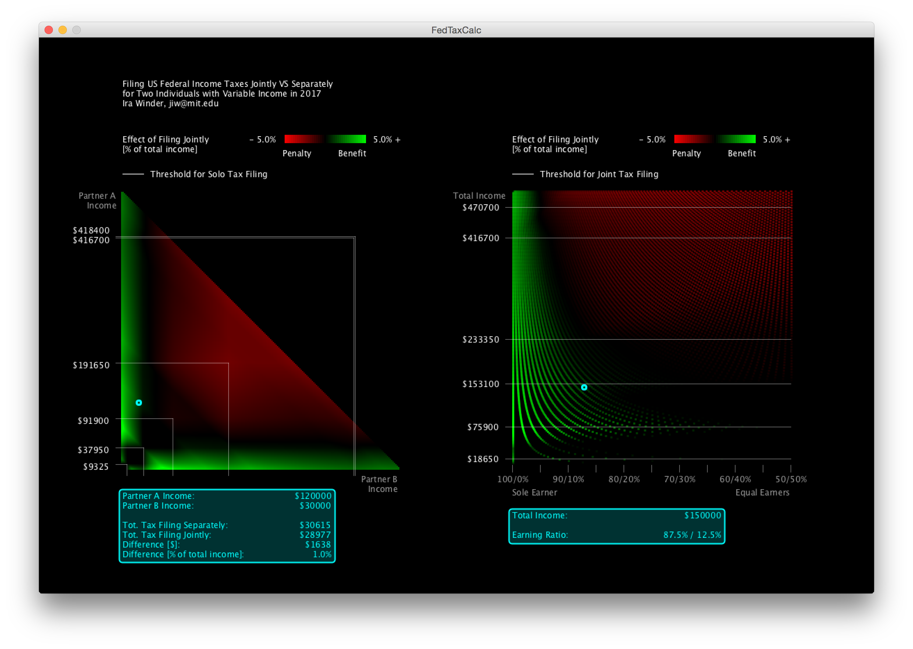

# FluxMap
This application generates a visualization to examine the outcome for theoretical couples of various incomes filing their taxes jointly or separately. When application is open, mouse cursor may be used to explore fine-grain analysis of specific income pairs.

# Directions:
1. Download Processing (2.2.1) - https://processing.org/download/
2. Confirm latest Java is installed https://java.com/en/download/mac_download.jsp
3. Clone this GitHub repository
4. Run "FedTaxCalc.pde" using Processing application

# Combined Income up to $500k
 
